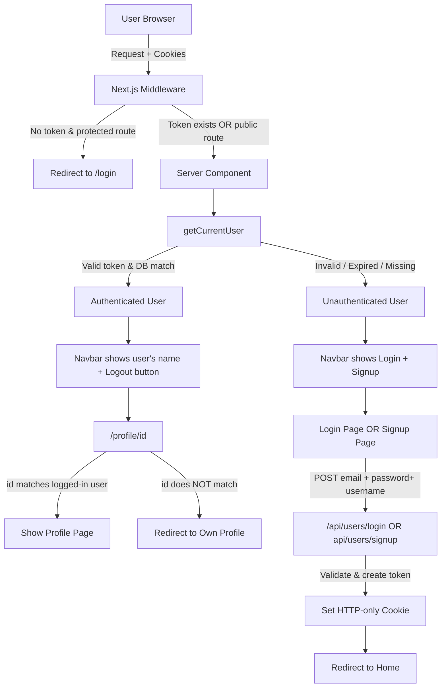

## Why This Project Exists

This project was built to better understand how authentication (basics) works in modern
web applications and to demonstrate those concepts clearly in code

## Authentication Flow

## what more can be done ?

- Add refresh tokens for longer-lived sessions
- Support multiple active sessions per user
- Add role-based access control for admin users
- Add rate limiting for auth-related endpoints

## A getting started section ... WIP
